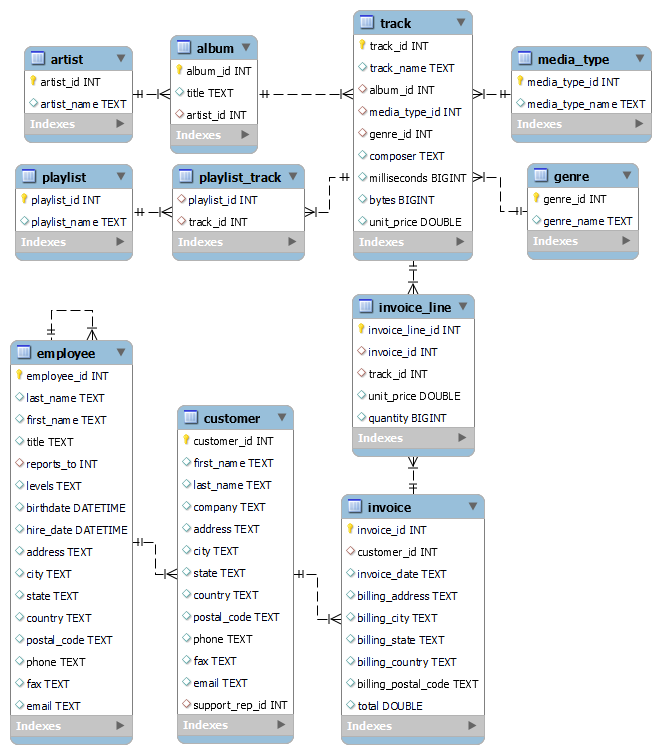

# Using SQL in Python

- This repository contains the creation of a MySQL database based on: 
    - [https://github.com/avishek-choudhary/Music-Store-Analysis/tree/main](https://github.com/avishek-choudhary/Music-Store-Analysis/tree/main).

- The Python script is responsible for creating and populating tables through csv files.

- The relationships between the tables are presented below:

- **Author**: Glenda Proença Train

<p align="center">
    
</p>


- After creating the database, several questions are answered through SQL queries.

- Python and MySQL communicate with Docker, with a container for each service.

## How to run?
- After installing docker, just type in the command line:
```
docker-compose up
```
- If there is a problem with the docker connection, it may be that docker is trying to access your machine's local MySQL. One solution would be to stop local MySQL with Windows+R "services.msc".

- If you want run locally, change the host in the python script (to "localhost") and change de username in "credentials.json" to some username.

## Questions and Answers
- The questions and corresponding queries to answer these questions will be listed here.

### 1) What is the most popular music genre?
```
SELECT COUNT(track.genre_id) AS popularity, genre.genre_name
FROM track
JOIN genre ON track.genre_id = genre.genre_id
GROUP BY genre.genre_name
ORDER BY popularity DESC LIMIT 1
```
- It is Rock.
### 2) What is the most popular artist?
```
SELECT COUNT(invoice_line.quantity) AS purchases, 
       artist.artist_name AS artist_name
FROM invoice_line
INNER JOIN track ON track.track_id = invoice_line.track_id
INNER JOIN album ON track.album_id = album.album_id
INNER JOIN artist ON artist.artist_id = album.artist_id 
GROUP BY artist_name
ORDER BY purchases DESC
LIMIT 1
```
- It is Queen.
### 3) What is the most popular song?
```
SELECT COUNT(invoice_line.quantity) AS purchases,
       track.track_name AS track_name
FROM invoice_line
INNER JOIN track ON track.track_id = invoice_line.track_id
GROUP BY track_name
ORDER BY purchases DESC
LIMIT 1
```
- It is War Pigs.
### 4) What is the average price of different types of music?
```
WITH purchases AS
	(SELECT SUM(invoice.total) AS total_spent, genre.genre_name AS genre
	 FROM invoice
	 INNER JOIN invoice_line ON invoice_line.invoice_id = invoice.invoice_id
	 INNER JOIN track ON track.track_id = invoice_line.track_id
	 INNER JOIN genre ON genre.genre_id = track.genre_id
	 GROUP BY genre.genre_name
     ORDER BY total_spent)
SELECT genre, CONCAT('$', ROUND(AVG(total_spent))) AS total
FROM purchases
GROUP BY genre
```
- The top 3: 
    - Drama | $6
    - TV Shows | $20
    - Soundtrack | $47
### 5) What is the most popular country for music purchases?
```
SELECT SUM(invoice_line.quantity) AS invoice_quantity,
       customer.country AS country
FROM invoice_line
INNER JOIN invoice ON invoice.invoice_id = invoice_line.invoice_line_id
INNER JOIN customer ON customer.customer_id = invoice.customer_id
GROUP BY country
ORDER BY invoice_quantity DESC
LIMIT 1
```
- It is USA.
### 6) Who is the longest serving employee?
```
SELECT first_name, last_name FROM employee
ORDER BY hire_date ASC
LIMIT 1
```
- It is Mohan Madan.
### 7) Which country has the most invoices?
```
SELECT COUNT(invoice_id) as invoice_quantity, billing_country
FROM invoice 
GROUP BY billing_country
ORDER BY invoice_quantity DESC
```
- It is USA, with 131 invoices.
### 8) What is the top 3 in total invoice values?
```
SELECT * FROM invoice
ORDER BY total DESC
LIMIT 3
```
Invoice Id x Customer Id x Invoice Date x Billing Address x Billing Country x Total

183 | 42 | 2018-02-09 | 9, Place Louis Barthou | France | 23.76

92 | 32 | 2017-07-02 | 696, Osborne Street | Canada | 19.8

526 | 5 | 2020-06-08 | Klanova 9/506 | Czech Republic | 19.8

### 9) Which city has the best customers?
```
SELECT billing_city, 
       CONCAT("$", ROUND(SUM(total), 2)) AS invoice_total 
FROM invoice
GROUP BY billing_city
ORDER BY SUM(total) DESC
LIMIT 1
```
- It is Prague, with $273.24 as total invoice.
### 10) Who is the best customer?
```
SELECT CONCAT("$", ROUND(SUM(invoice.total), 2)) AS invoice_total,
       customer.first_name, customer.last_name
FROM invoice
INNER JOIN customer ON customer.customer_id = invoice.customer_id
GROUP BY customer.customer_id
ORDER BY SUM(invoice.total) DESC
```
- It is František Wichterlová, with a total invoice of $144.54.
### 11) Who are rock listeners?
```
SELECT DISTINCT customer.first_name, customer.last_name, customer.email, genre.genre_name
FROM customer
INNER JOIN invoice ON invoice.customer_id = customer.customer_id
INNER JOIN invoice_line ON invoice_line.invoice_id = invoice.invoice_id
INNER JOIN track ON track.track_id = invoice_line.track_id
INNER JOIN genre ON genre.genre_id = track.genre_id
WHERE genre.genre_name = 'Rock'
ORDER BY customer.email ASC
```
- The top 3: (First Name x Last Name x Email x Genre Name)
    - Aaron	Mitchell | aaronmitchell@yahoo.ca | Rock
    - Alexandre	Rocha | alero@uol.com.br | Rock
    - Astrid Gruber | astrid.gruber@apple.at | Rock
### 12) What are the top 10 rock bands?
```
SELECT COUNT(track.track_id) AS num_songs, artist.artist_name
FROM track
INNER JOIN album ON album.album_id = track.album_id
INNER JOIN artist ON artist.artist_id = album.artist_id 
WHERE genre_id IN 
    (SELECT genre.genre_id FROM genre
	 WHERE genre.genre_name = "Rock")
     GROUP BY artist.artist_id
     ORDER BY num_songs DESC
     LIMIT 10
```
- The top 10: (Num songs x Band)
    - 114 | Led Zeppelin
    - 112 | U2
    - 92 | Deep Purple
    - 81 | Iron Maiden
    - 54 | Pearl Jam
    - 52 | Van Halen
    - 45 | Queen
    - 41 | The Rolling Stones
    - 40 | Creedence Clearwater Revival
    - 35 | Kiss
### 13) Which tracks are longer than average in length?
```
SELECT track.track_name, track.milliseconds FROM track
WHERE track.milliseconds >
	(SELECT AVG(milliseconds) FROM track)
     ORDER BY track.milliseconds DESC
```
- The top 3: (Track Name x Milliseconds)
    - Occupation / Precipice | 5286953
    - Through a Looking Glass | 5088838
    - Greetings from Earth, Pt. 1 | 2960293
### 14) How much did each client spend on each artist?
```
WITH artists_name AS
	(SELECT artist.artist_id AS artist_id,
		    artist.artist_name AS artist_name
	 FROM invoice_line
	 JOIN track ON track.track_id = invoice_line.track_id
	 JOIN album ON album.album_id = track.album_id
	 JOIN artist ON artist.artist_id = album.artist_id 
	 GROUP BY artist.artist_id)
SELECT customer.customer_id AS customer_id,
	   customer.first_name AS first_name,
	   artists_name.artist_name AS artist_name,
	   SUM(invoice_line.unit_price * invoice_line.quantity) AS total_spent
FROM invoice
JOIN customer ON customer.customer_id = invoice.customer_id
JOIN invoice_line ON invoice_line.invoice_id = invoice.invoice_id
JOIN track ON track.track_id = invoice_line.track_id
JOIN album ON album.album_id = track.album_id
JOIN artists_name ON artists_name.artist_id = album.artist_id
GROUP BY 1, 2, 3
ORDER BY 4 DESC
```
- The top 3: (Customer Name x Artist Name x Total Spent)
    - Hugh | Queen | 27.72
    - Wyatt | Frank Sinatra | 23.76
    - François | The Who | 19.80
### 15) What is the most popular musical genre in each country?
```
WITH popular_genre AS
    (SELECT COUNT(invoice_line.quantity) AS purchases,
		    customer.country, genre.genre_name AS genre_name,
            ROW_NUMBER() OVER(PARTITION BY customer.country
            ORDER BY COUNT(invoice_line.quantity) DESC) AS row_num
     FROM invoice_line
     INNER JOIN invoice ON invoice.invoice_id = invoice_line.invoice_id
     INNER JOIN customer ON customer.customer_id = invoice.customer_id
     INNER JOIN track ON track.track_id = invoice_line.track_id
     INNER JOIN genre ON genre.genre_id = track.genre_id
     GROUP BY 2, 3
     ORDER BY 2 ASC, 1 DESC)
SELECT country, genre_name, purchases
FROM popular_genre
WHERE row_num <= 1
```
- The top 3: (Country x Genre Name x Purchases)
    - Argentina | Alternative & Punk | 17
    - Australia | Rock | 34
    - Austria | Rock | 40
### 16) Which customer spent the most in each country?
```
WITH total_customer_country AS 
    (SELECT customer.first_name,
	        billing_country,
            SUM(invoice.total) AS total_spent,
            ROW_NUMBER() OVER(PARTITION BY billing_country ORDER BY SUM(total) DESC) AS row_num
     FROM customer
     INNER JOIN invoice ON invoice.customer_id = customer.customer_id
     GROUP BY 1, 2
     ORDER BY 2, total_spent DESC)
SELECT first_name, billing_country, total_spent
FROM total_customer_country
WHERE row_num = 1
```
- The top 3: (Customer Name x Country x Total Spent)
    - Diego | Argentina | 39.6
    - Mark | Australia | 81.18
    - Astrid | Austria | 69.3